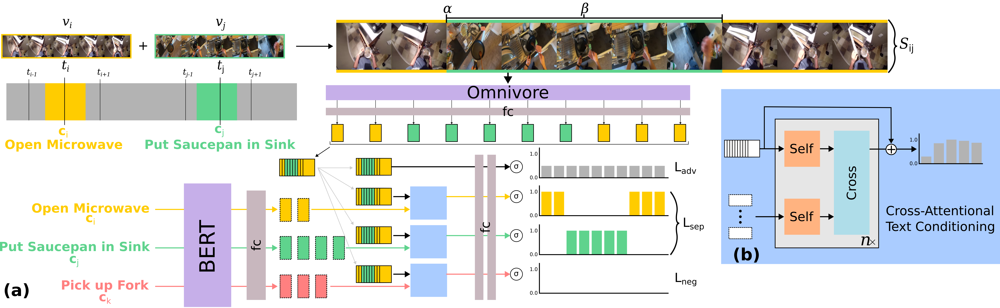

---
# Feel free to add content and custom Front Matter to this file.
# To modify the layout, see https://jekyllrb.com/docs/themes/#overriding-theme-defaults

layout: default
---
<h1><p style="text-align: center;">Kevin Flanagan, <a href="https://dimadamen.github.io">Dima Damen</a>, <a href="https://mwray.github.io/">Michael Wray</a></p></h1>
<p style="text-align: center;">University of Bristol</p>

<i>Overview of CliMer. (a) We generate a merged segment (S<sub>ij</sub>) from two clips (v<sub>i</sub> /v<sub>j</sub>)
of one long video to contrast against sentences c<sub>i</sub> /c<sub>j</sub> /c<sub>k</sub>. The video features are conditioned
using extracted text features and trained with 3 losses L<sub>adv</sub>, L<sub>sep</sub>, L<sub>neg</sub>. (b) Cross-Attentional
Text Conditioning uses n blocks of self- and cross-attention to condition the text.</i>
## Abstract

The onset of long-form egocentric datasets such as Ego4D and EPIC-Kitchens presents
a new challenge for the task of Temporal Sentence Grounding (TSG). Compared to traditional 
benchmarks on which this task is evaluated, these datasets offer finer-grained
sentences to ground in notably longer videos. In this paper, we develop an approach 
for learning to ground sentences in these datasets using only narrations and their corresponding 
rough narration timestamps. We propose to artificially merge clips to train
for temporal grounding in a contrastive manner using text-conditioning attention. This
Clip Merging (CliMer) approach is shown to be effective when compared with a high
performing TSG method—e.g. mean R@1 improves from 3.9 to 5.7 on Ego4D and
from 10.7 to 13.0 on EPIC-Kitchens. Code and data splits available from: [https://github.com/keflanagan/CliMer](https://github.com/keflanagan/CliMer)

## Paper

insert arxiv link here

## Poster

insert link to poster here

## Code, Data Splits and Features

The code, dataset splits and links for features can be found [here](https://github.com/keflanagan/CliMer)

## Bibtex

```
@InProceedings{flanagan2023climer,
    author    ={Flanagan, Kevin and Damen, Dima and Wray, Michael},
    title     ={Learning Temporal Sentence Grounding From Narrated EgoVideos},
    booktitle ={British Machine Vision Conference (BMVC)},
    year      ={2023}
}
```

## Acknowledgements

K Flanagan is supported by UKRI (Grant ref EP/S022937/1) CDT in
Interactive AI & Qinetiq Ltd via studentship CON11954. D Damen is supported by EPSRC
Fellowship UMPIRE (EP/T004991/1) & EPSRC Program Grant Visual AI (EP/T028572/1)
